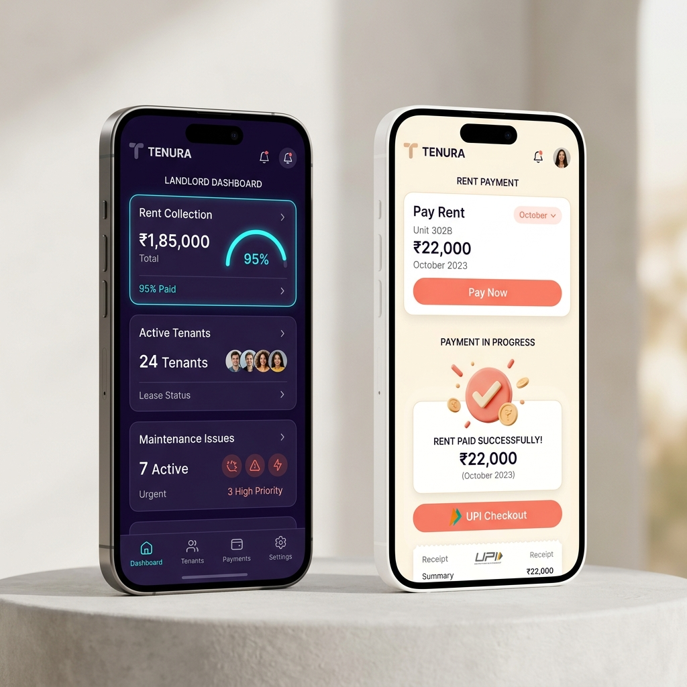
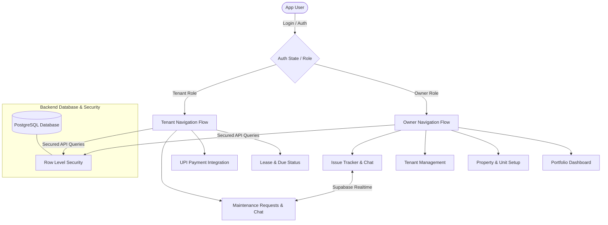

# 🏛️ Tenura

<p align="center">
  <b>Precision-crafted property management for modern landlords and tenants.</b><br>
  A high-fidelity, double-sided mobile application built to put rent collection and maintenance on autopilot.
</p>

<p align="center">
  
</p>

<p align="center">
  
  
  
  
</p>

---

## 💎 Design System & Philosophy

Tenura is designed with a premium, dual-aesthetic color system:
* **Landlord Mode**: A sleek, high-contrast dark space violet theme with glowing neon cyan accents.
* **Tenant Mode**: A warm, clean light cream theme with soft coral highlights.

### 🎭 Double-Sided Navigational Flow

Based on the authenticated user's role stored in Supabase, the application dynamically gates navigation:



---

## ⚡ Features Matrix

| Feature | Landlord Portal (Owner) | Tenant Portal |
| :--- | :--- | :--- |
| **Dashboard** | 📊 Portfolio metrics, Occupancy, Rent Due, Financial Overview | 🏠 Current rent status, Due dates, Landlord profile |
| **Rent Collection** | 💰 Rent collection logs, Transaction logs, Ledger | 💳 Instant UPI payment options (Google Pay, PhonePe, Paytm) |
| **Maintenance** | 🔧 Priority-based request tracker, verified vendors | 🛠️ Multi-step photo ticket submission & tracking |
| **Realtime Chat** | 💬 WebSockets chat directly linked to repair ticket | 💬 WebSockets chat directly linked to repair ticket |
| **Document Vault** | 📄 Onboard tenants, define lease duration, secure storage | 📄 View lease details and generate PDF receipts on-device |

---

## 🛠&nbsp; Tech Stack & Architecture

* **Frontend Framework:** React Native with Expo (SDK 54)
* **Navigation Architecture:** React Navigation 7 (Native Stacks + Bottom Tab bars)
* **Backend Database:** Supabase (Postgres Database, Storage, and Real-time channels)
* **PDF Compilation:** client-side HTML to PDF generation using `expo-print` and native sharing with `expo-sharing`

### 📂 Directory Structure

```
Tenura/
├── src/
│   ├── context/    – Auth state, role context, and email auto-link
│   ├── navigation/ – Stack + Bottom Tab navigation flows per role
│   ├── screens/    – Auth screens, owner portals, and tenant portals
│   ├── components/ – Atoms & Molecules (MetricCard, buttons, ScreenHeader)
│   ├── lib/        – Supabase client setup & PDF receipt compiler
│   └── theme/      – Spacing, typography, and light/dark color palettes
└── supabase/
    ├── migrations/ – Table schemas, RLS security policies, and SQL scripts
    └── seed/       – Production-grade seed data for local testing
```

---

## 🚀 Getting Started & Demo Setup

For a complete guide to configuring Supabase, setting up test tenant accounts, and running the walkthrough script, please refer to:
* 📄 **[DEMO_SETUP_GUIDE.md](./DEMO_SETUP_GUIDE.md)** — Step-by-step Supabase database configuration & seeding.
* 🎬 **[DEMO_SCRIPT.md](./DEMO_SCRIPT.md)** — Slide-by-slide and talk-track walkthrough for presenting the app.

---

## 🔒 Security & Row Level Security (RLS)

Tenura enforces strict **Row Level Security (RLS)** at the database layer. No queries can access or bypass owner-tenant bounds:
* **Properties & Leases:** Secured by authenticated Owner and Tenant IDs.
* **Auto-Link Onboarding:** When a tenant registers, a database query checks their email against the pre-seeded tenant table and automatically links their Auth profile to their lease details instantly.
* **Communications:** Chat messages can only be retrieved by the corresponding lease owner and tenant.

---

## 📅 Roadmap & Next Phases

- [x] High-Contrast UI Contrast fixes for Light and Dark Modes
- [x] Smooth Linear Progress Bar Animation on Login
- [x] On-Device PDF Receipt Generation & Native Sharing
- [x] Real-time messaging for maintenance tickets
- [ ] **Razorpay SDK Integration** for live UPI/Card processing
- [ ] **Expo Push Notifications** for rent reminders and chat notifications

