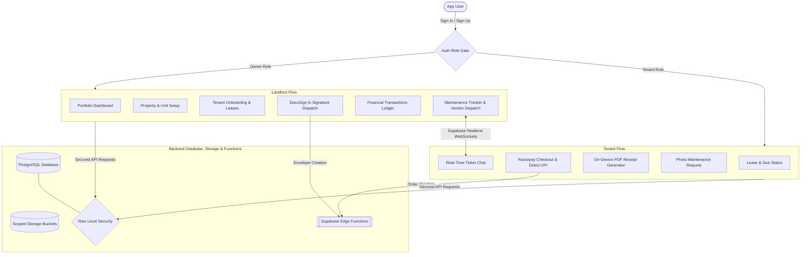

# 🏛️ Tenura

<p align="center">
  <b>Precision-crafted property management for modern landlords and tenants.</b><br>
  A high-fidelity, double-sided mobile application with automated rent collection, DocuSign e-signatures, real-time maintenance workflows, and bank-grade backend security.
</p>

<p align="center">
  
  
  
  
  
  
</p>

---

## 💎 Design System & Double-Sided Experience

Tenura delivers a role-based, dual-aesthetic experience tailored to each user:
* **Landlord Mode (Owner):** Sleek, high-contrast dark space violet theme with glowing neon cyan accents.
* **Tenant Mode:** Clean, warm light cream theme with soft coral and rose highlights.

### 🎭 Navigational Architecture

Authentication status and user role in Supabase dynamically gate navigation:


```mermaid
graph TD
    User([App User]) -->|Sign In / Sign Up| Auth{Auth Role Gate}
    Auth -->|Owner Role| OwnerFlow[Landlord Portal]
    Auth -->|Tenant Role| TenantFlow[Tenant Portal]
    
    subgraph OwnerFlow [Landlord Flow]
        OwnerDash[Portfolio Dashboard]
        Properties[Property & Unit Setup]
        Tenants[Tenant Onboarding & Leases]
        DocuSignSend[DocuSign E-Signature Dispatch]
        FinanceLedger[Financial Transactions Ledger]
        OwnerIssues[Maintenance Tracker & Vendor Dispatch]
    end
    
    subgraph TenantFlow [Tenant Flow]
        TenantDash[Lease & Due Status]
        RentPay[Razorpay Checkout & Direct UPI]
        PDFGen[On-Device PDF Receipt Generator]
        IssueSubmit[Photo Maintenance Request]
        TenantChat[Real-Time Ticket Chat]
    end
    
    OwnerIssues <-->|Supabase Realtime WebSockets| TenantChat
    
    subgraph Supabase [Backend Database, Storage & Functions]
        DB[(PostgreSQL Database)]
        Storage[(Scoped Storage Buckets)]
        EdgeFunctions[[Supabase Edge Functions]]
        RLS{Row Level Security}
        DB --- RLS
    end
    
    OwnerFlow & TenantFlow -->|Secured API Requests| RLS
    RentPay -->|Order Creation| EdgeFunctions
    DocuSignSend -->|Envelope Creation| EdgeFunctions
```

---

## ⚡ Features Matrix

| Feature | Landlord Portal (Owner) | Tenant Portal |
| :--- | :--- | :--- |
| **Portfolio Dashboard** | Occupancy metrics, rent collected vs. overdue, active leases | Active lease terms, days until rent due, landlord contact card |
| **Rent Collection & Payments** | Automated financial transactions ledger, payment status log | **Razorpay** Web Checkout (Cards/NetBanking/UPI) + **Direct UPI** intent flow |
| **Payment Verification** | Verified transaction history with 12-digit UTR review | Instant on-device PDF rent receipt generation and native sharing |
| **DocuSign E-Signatures** | One-click lease dispatch to DocuSign; automatic status sync | Review and sign digital lease agreements directly via DocuSign |
| **Maintenance & Repairs** | Sequence-based tickets (`CASE-5000+`), priority badges, vendor assignment | Multi-step photo ticket submission with camera/gallery upload |
| **Realtime Messaging** | Direct WebSockets messaging per maintenance ticket | Realtime ticket chat with landlord and status indicators |
| **Community & Alerts** | Broadcast building announcements and emergency alerts | View property notices, building alerts, and amenities |
| **Storage Vault** | Property images, encrypted leases, avatar uploads | Attached maintenance defect photos, downloaded receipts |

---

## 🛡️ Backend Engineering & Security Hardening

The backend is built on Supabase (PostgreSQL 15, Auth, Storage, and Edge Functions) and hardened with bank-grade security:

### 1. Database Security & Permissions
* **`auth.users` Lockdown**: Revoked all direct access from `anon` and `authenticated` roles to eliminate user enumeration or unauthorized introspection. All user profile data is accessed strictly through `public.users`.
* **Tamper-Proof Payment & Lease RLS**: Dropped permissive client-side update policies. Tenants cannot tamper with rent amounts or update payment statuses directly. All rent status transitions are processed via server-side Edge Functions or stored procedures.
* **Storage Bucket Hardening**: The `leases` bucket is configured strictly **private**. All storage buckets (`leases`, `maintenance-photos`, `avatars`, `properties`) enforce granular RLS policies matching authenticated user IDs.

### 2. Data Integrity & Automated Triggers
* **Automatic Profile Provisioning**: A database trigger (`on_auth_user_created`) automatically populates `public.users` with the user's name and email upon auth sign-up.
* **Automated Financial Ledger**: A database trigger (`trg_payment_paid_transaction`) automatically inserts a balanced record into the `transactions` ledger whenever a payment is confirmed as `paid`.
* **Collision-Proof Maintenance IDs**: Replaced volatile client counters with a database sequence (`maintenance_case_seq` starting at `CASE-5000`) and enforced a `UNIQUE` constraint on `case_number`.
* **Case-Insensitive Tenant Auto-Link**: Tenant invitations and onboarding normalize emails with `lower(email)` and enforce strict upsert ordering to prevent foreign key violations (`23503`).

### 3. Supabase Edge Functions (Deno / TypeScript)
* **`razorpay`**: Validates the actual rent amount from the database row prior to order creation (preventing client-side amount manipulation). Includes client IP/user rate limiting and automatic expired TTL purging against `rate_limits`.
* **`send-for-signature`**: Integrates with DocuSign e-Signature REST API v2.1 with pre-flight checks blocking duplicate envelope creation (`409 Conflict`).
* **`docusign-webhook`**: Receives DocuSign Connect webhook events with HMAC-SHA256 signature verification, automatically transitioning leases to `signed` upon completion.

### 4. Supabase Realtime Publication
* Full replication (`REPLICA IDENTITY FULL`) enabled in `supabase_realtime` across:
  - `issue_messages` (chat messages)
  - `maintenance_requests` (tickets)
  - `payments` (rent payments)
  - `announcements` & `alerts` (community notices)

---

## 🛠️ Tech Stack

* **Frontend Framework:** React Native 0.81 with Expo (SDK 54)
* **JS Engine:** Hermes Bytecode Engine
* **Navigation:** React Navigation 7 (Native Stacks + Custom Bottom Tab Bars)
* **Backend Platform:** Supabase (PostgreSQL 15, Deno Edge Functions, GoTrue Auth, Storage)
* **Payment Gateways:** Razorpay Standard Web Checkout + Direct UPI Intent (GPay, PhonePe, Paytm)
* **Digital Signatures:** DocuSign e-Signature REST API v2.1 with Connect Webhooks
* **Document Compilation:** `expo-print` (HTML to PDF) and `expo-sharing` (native file sharing)
* **Realtime Sync:** Supabase Realtime Channels (WebSockets)

---

## 📂 Project Structure

```
Tenura/
├── assets/                       – Static icons, logos, and illustration assets
├── src/
│   ├── components/               – Atoms, molecules, buttons, MetricCards, headers
│   ├── context/                  – AuthContext (role state, tenant auto-link)
│   ├── lib/                      – Supabase client, PDF receipt compiler, payment helpers
│   ├── navigation/               – AppNavigator, OwnerTabNavigator, TenantTabNavigator
│   ├── screens/
│   │   ├── auth/                 – Login, Register, RoleSelection screens
│   │   ├── owner/                – Dashboard, Properties, Tenants, Finance, Maintenance
│   │   ├── tenant/               – TenantDashboard, RentPayment, MaintenanceRequest
│   │   └── shared/               – IssueMessagesScreen, CommunityAnnouncements
│   └── theme/                    – Color palettes, typography, spacing, elevations
└── supabase/
    ├── functions/                – Deno Edge Functions
    │   ├── docusign-webhook/     – HMAC-verified webhook for DocuSign status updates
    │   ├── razorpay/             – Server-side order creation & verification with rate limiting
    │   └── send-for-signature/   – Lease agreement envelope dispatcher
    └── migrations/               – 25 incremental PostgreSQL migrations & RLS policies
```

---

## 🚀 Getting Started

### Prerequisites
* [Node.js](https://nodejs.org/) (v18 or higher recommended)
* [Expo CLI](https://docs.expo.dev/get-started/installation/) (`npm install -g expo-cli` or via `npx`)
* [Supabase CLI](https://supabase.com/docs/guides/cli) (for Edge Function deployment and migrations)
* iOS Simulator / Android Emulator or the Expo Go mobile app

### 1. Clone the Repository
```bash
git clone https://github.com/Rudvik-17/Tenura.git
cd Tenura
git checkout Bug-fix
```

### 2. Install Dependencies
```bash
npm install
```

### 3. Configure Environment Variables
Create a local `.env` file based on the provided [`.env.example`](./.env.example):
```bash
cp .env.example .env
```
Fill in your credentials:
```env
EXPO_PUBLIC_SUPABASE_URL=https://your-project-ref.supabase.co
EXPO_PUBLIC_SUPABASE_ANON_KEY=your-supabase-anon-key
EXPO_PUBLIC_RAZORPAY_KEY_ID=rzp_test_your_key_id

# DocuSign (Optional for e-signature testing)
DOCUSIGN_INTEGRATION_KEY=your-integration-key
DOCUSIGN_SECRET_KEY=your-secret-key
DOCUSIGN_ACCOUNT_ID=your-account-id
DOCUSIGN_BASE_URI=https://demo.docusign.net
DOCUSIGN_USER_ID=your-user-id
DOCUSIGN_ACCESS_TOKEN=your-access-token
```

### 4. Database Setup & Migrations
Link your local Supabase project and apply migrations:
```bash
npx supabase link --project-ref your-project-ref
npx supabase db push
```

### 5. Deploy Edge Functions
```bash
npx supabase functions deploy razorpay --no-verify-jwt
npx supabase functions deploy send-for-signature --no-verify-jwt
npx supabase functions deploy docusign-webhook --no-verify-jwt
```

### 6. Start the App
```bash
npx expo start
```
* Press `i` to open in iOS Simulator.
* Press `a` to open in Android Emulator.
* Scan the QR code with Expo Go to run on a physical device.

---

## 🧪 Verification & Build Status

* **Hermes Bytecode Compilation**:
  - iOS Hermes Bundle: **1,153 modules** compiled with 0 errors.
  - Android Hermes Bundle: **1,236 modules** compiled with 0 errors.
* **Automated Test Suite**:
  - Database security & RLS policies: **PASS**
  - Edge Functions & DocuSign webhook HMAC verification: **PASS**
  - Triggers, sequences & ledger auto-sync: **PASS**
  - Realtime publications & storage policies: **PASS**

---

## 🗺️ Roadmap

- [x] Dual-theme High Contrast UI (Space Violet Dark Mode & Warm Cream Light Mode)
- [x] Double-sided Role Gate & Navigation (Landlord vs. Tenant)
- [x] On-Device PDF Rent Receipt Generation & Native Sharing
- [x] Real-time WebSockets Chat for Maintenance Tickets
- [x] **Razorpay Standard Web Checkout** & **Direct UPI Flow** (with 12-digit UTR confirmation)
- [x] **DocuSign e-Signature Integration** with HMAC Webhook & Duplicate Envelope Guard
- [x] Collision-Proof Maintenance Sequence (`maintenance_case_seq`) & Photo Attachments
- [x] Bank-Grade Security Hardening (RLS, `auth.users` lockdown, rate limiting)
- [x] Automated Accounting Ledger Triggers (`trg_payment_paid_transaction`)
- [ ] Expo Push Notifications for rent reminders and maintenance alerts
- [ ] Multi-currency & international payment gateway support

