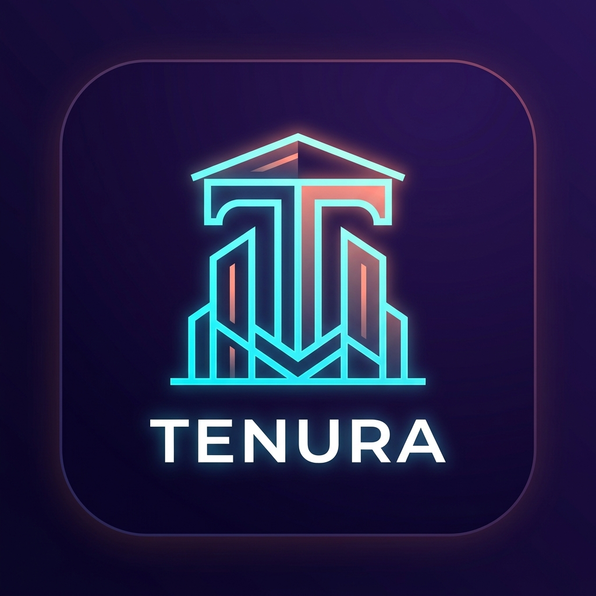
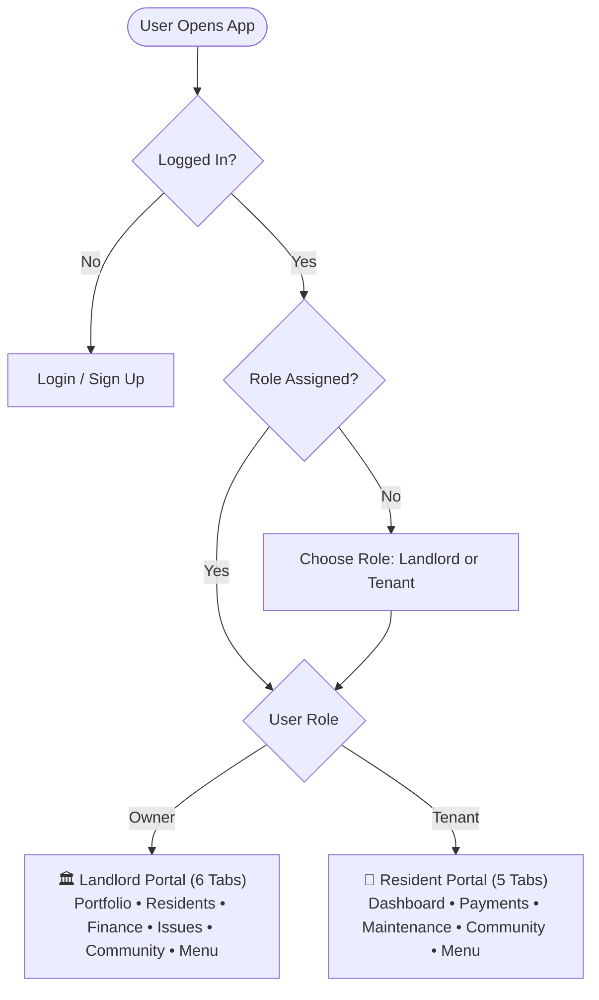

# 🏛️ Tenura

<p align="center">
  
</p>

<p align="center">
  <b>Modern estate and property management for landlords and tenants.</b><br>
  A high-fidelity mobile app with automated rent collection, DocuSign digital leases, real-time maintenance workflows, and bank-grade backend security.
</p>

<p align="center">
  <a href="https://reactnative.dev/"></a>
  <a href="https://expo.dev/"></a>
  <a href="https://react.dev/"></a>
  <a href="https://supabase.com/"></a>
  <a href="https://www.postgresql.org/"></a>
  <a href="https://razorpay.com/"></a>
  <a href="https://www.docusign.com/"></a>
  <a href="https://www.typescriptlang.org/"></a>
</p>

---

## ⚡ Tech Stack at a Glance

| Layer | Technology | Purpose in Tenura |
| :--- | :--- | :--- |
| **Mobile Core** |  **React Native 0.85** | Fast, cross-platform native iOS & Android framework |
| **Tooling & Runtime** |  **Expo SDK 56** | Hermes Bytecode Engine, native APIs, icons, and fonts |
| **Backend Platform** |  **Supabase** | GoTrue Auth, Realtime WebSockets, Storage, and Deno Edge Functions |
| **Database** |  **PostgreSQL 15** | Row Level Security (RLS), sequence generators, automated triggers |
| **Payment Gateway** |  **Razorpay & Direct UPI** | Cards, NetBanking & deep-linking for Google Pay, PhonePe, Paytm |
| **Digital Contracts** |  **DocuSign REST API v2.1** | JWT Bearer OAuth grant, digital lease dispatch, HMAC webhooks |
| **PDF Engine** |  **expo-print & expo-sharing** | Instant on-device PDF rent receipt and lease agreement generator |
| **Realtime Sync** |  **Supabase Realtime** | Live messaging channel for maintenance tickets |
| **Language** |  **TypeScript & JavaScript** | Typed hooks, serverless edge functions, and UI components |

---

## 💡 What is Tenura?

Tenura replaces paper agreements, payment screenshots, and disorganized chat groups with an all-in-one mobile platform built for two distinct user roles:

1. **For Landlords (Owners):** Oversee multiple properties, monitor revenue in Indian denominations (₹ Lakhs & Crores), onboard tenants with automatic email matching, dispatch DocuSign digital leases, and assign maintenance contractors.
2. **For Residents (Tenants):** View active lease terms, pay rent with zero hassle via Direct UPI or Razorpay, download instant PDF receipts, report maintenance issues with photos, and chat in real-time with management.

---

## 📱 Navigation & User Flow

Authentication status and role gate access automatically upon login:


```mermaid
flowchart TD
    User([User Opens App]) --> AuthCheck{Logged In?}
    AuthCheck -- No --> Auth[Login / Sign Up]
    AuthCheck -- Yes --> RoleCheck{Role Assigned?}
    
    RoleCheck -- No --> SelectRole[Choose Role: Landlord or Tenant]
    RoleCheck -- Yes --> Gate{User Role}
    SelectRole --> Gate
    
    Gate -- Owner --> OwnerPortal["🏛️ Landlord Portal (6 Tabs)\nPortfolio • Residents • Finance • Issues • Community • Menu"]
    Gate -- Tenant --> TenantPortal["🏡 Resident Portal (5 Tabs)\nDashboard • Payments • Maintenance • Community • Menu"]
```

---

## ✨ Features

### 🏛️ Landlord / Owner Experience
* **Portfolio Dashboard:** High-level metrics showing occupancy rate, collected rent, and overdue balances.
* **Smart Tenant Onboarding:** Enter tenant details and lease terms; Tenura automatically links their account when they sign up with that email.
* **DocuSign Lease Dispatch:** Compile digital leases to PDF and send them to tenants for signature via DocuSign in one click.
* **Financial Ledger:** Real-time income and expense tracking automatically updated whenever a payment is confirmed.
* **Maintenance Tracker:** Sequence-generated ticket IDs (`CASE-5000+`) with priority flags and contractor dispatch.
* **Building Community:** Post public notices, manage office contact cards, and showcase building amenities.

### 🏡 Resident / Tenant Experience
* **Rent Payments:** Pay using your preferred method:
  * **Direct UPI Intent:** One-tap launch into Google Pay, PhonePe, or Paytm.
  * **Razorpay Checkout:** Credit/Debit Cards, NetBanking, and Wallets.
  * **12-Digit UTR Input:** Direct bank transfer verification.
* **Instant PDF Receipts:** On-device receipt compilation (`expo-print`) with native sharing (`expo-sharing`).
* **Photo Maintenance Requests:** Snap and upload photos with category tags and priority ratings.
* **Live Ticket Chat:** WebSocket-powered chat with landlords on open maintenance tickets.
* **Automated Due Date Reminders:** 9:00 AM local notification on rent due dates via `expo-notifications`.

---

## 🎨 Design System: "The Precision Atelier"

Tenura features a dual-theme aesthetic tailored for day-to-day usability:

* **Atelier Light (Default):** Warm ivory surfaces (`#FCFBFA`), soft coral accents (`#FC805C`), and mint green positive signals (`#27C485`).
* **Cyber Dark:** Deep space violet surfaces (`#0C0B14`), electric cyan accents (`#00E5FF`), and neon highlights.
* **Typography:** **Manrope** for numbers and bold headlines; **Inter** for readable metadata and forms.

---

## 🔒 Security Highlights

* **Zero-Trust Payments:** Payment amounts are validated directly against PostgreSQL database rows in Edge Functions before orders are created (no client-side tampering).
* **Locked-Down User Profiles:** Direct queries to `auth.users` are revoked; profile data is synced securely to `public.users` via database triggers.
* **HMAC-SHA256 Webhooks:** Inbound DocuSign Connect events require cryptographic signature verification before updating contract statuses.
* **Automated Accounting Triggers:** PostgreSQL trigger `trg_payment_paid_transaction` automatically records confirmed payments into the ledger.
* **Rate-Limiting Defense:** Client buttons use a 7-click/min threshold (`useRateLimit`), backed by a PostgreSQL `rate_limits` table in Edge Functions.

---

## 📂 Project Structure

```
Tenura/
├── assets/                  # App icon, splash screens, and vector assets
├── src/
│   ├── components/          # MetricCard, PrimaryButton, RateLimitedButton, ScreenHeader
│   ├── context/             # AuthContext (role gating), ThemeContext (dark/light)
│   ├── hooks/               # useRateLimit hook
│   ├── lib/                 # Supabase client, notifications, PDF templates
│   ├── navigation/          # RootNavigator, OwnerNavigator (6 tabs), TenantNavigator (5 tabs)
│   ├── screens/
│   │   ├── auth/            # Login, SignUp, RoleSelection
│   │   ├── owner/           # Dashboard, Properties, Finance, Issues, Community, Leases
│   │   ├── tenant/          # TenantDashboard, RentPayment, MaintenanceRequest, Agreement
│   │   └── shared/          # ProfileScreen, IssueMessagesScreen (Chat)
│   └── theme/               # Color tokens (Light & Dark), Manrope/Inter typography
└── supabase/
    ├── functions/           # Deno Edge Functions (razorpay, send-for-signature, docusign-webhook)
    └── migrations/          # 25+ SQL migrations with RLS policies, sequences & triggers
```

---

## 🚀 Getting Started

### 1. Prerequisites
* [Node.js](https://nodejs.org/) (v18+)
* [Expo Go](https://expo.dev/go) app on your mobile device (or iOS Simulator / Android Emulator)
* A [Supabase](https://supabase.com/) project

### 2. Installation
```bash
# Clone repository
git clone https://github.com/Rudvik-17/Tenura.git
cd Tenura

# Install dependencies
npm install
```

### 3. Environment Setup
Create a `.env` file in the root directory:
```bash
cp .env.example .env
```

Add your credentials:
```env
EXPO_PUBLIC_SUPABASE_URL=https://your-project.supabase.co
EXPO_PUBLIC_SUPABASE_ANON_KEY=your-anon-key
EXPO_PUBLIC_RAZORPAY_KEY_ID=rzp_test_your_key_id

# Optional: DocuSign (for e-signature flow)
DOCUSIGN_INTEGRATION_KEY=your-integration-key
DOCUSIGN_SECRET_KEY=your-secret-key
DOCUSIGN_ACCOUNT_ID=your-account-id
DOCUSIGN_BASE_URI=https://demo.docusign.net
DOCUSIGN_USER_ID=your-user-id
DOCUSIGN_ACCESS_TOKEN=your-access-token
```

### 4. Run the App
```bash
# Start Expo development server
npm start
```
* Press `i` to open in iOS Simulator
* Press `a` to open in Android Emulator
* Scan the QR code using the **Expo Go** app on your physical device

---

## 📋 Environment Variables Reference

| Key | Required | Purpose |
| :--- | :---: | :--- |
| `EXPO_PUBLIC_SUPABASE_URL` | **Yes** | Supabase project API URL |
| `EXPO_PUBLIC_SUPABASE_ANON_KEY` | **Yes** | Client anon key for safe client queries |
| `EXPO_PUBLIC_RAZORPAY_KEY_ID` | Optional | Razorpay public test/live key (simulator fallback included) |
| `DOCUSIGN_INTEGRATION_KEY` | Optional | DocuSign integration key for JWT grant |
| `DOCUSIGN_ACCOUNT_ID` | Optional | DocuSign account identifier |
| `DOCUSIGN_BASE_URI` | Optional | DocuSign base URI (`https://demo.docusign.net`) |

---

## 📄 License

This project is licensed under the **MIT License**.

<p align="center">
  Crafted with precision by <a href="https://github.com/Rudvik-17">Rudvik-17</a>.
</p>
